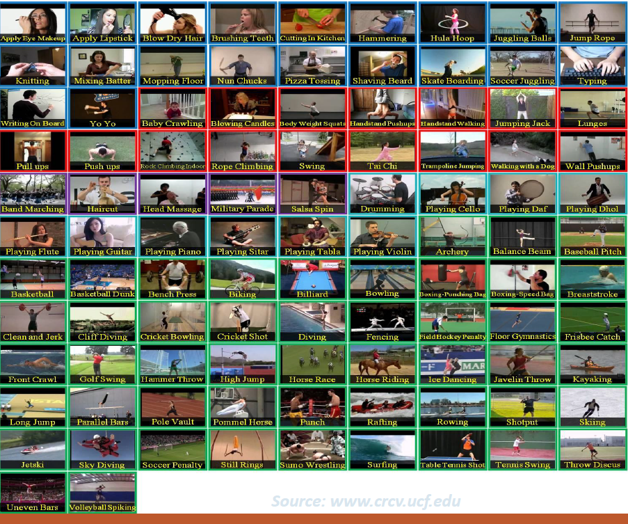
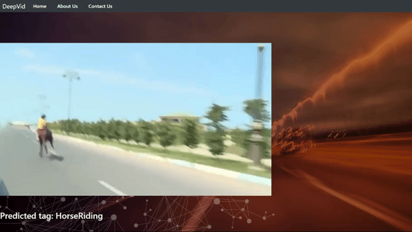

# Human Activity Recognition using Convolution Neural Networks

The given repository builds an efficient code for action recognition (humans) using [UCF101](http://crcv.ucf.edu/data/UCF101.php) with the help of [Keras](https://keras.io/). Convolution Neural Networks are used for training the dataset. Also, accuracies are compared for different pre-trained models trained on [Imagenet](http://www.image-net.org/) dataset. Videos can be viewed as a sequences of images(frames), thats why they can be processed in ways similar to images.


## Dataset


[UCF101](http://crcv.ucf.edu/data/UCF101.php) is an action recognition data set of realistic action videos, collected from YouTube, having 101 action categories. It consists a total of 13,320 videos from 101 actions.  

The video preprocessing has been done using [OpenCV](https://opencv.org/). Each videos is 25 fps. To reduce the amount of redundant data to be fed into the network, 1 frame per second from each video is extracted which later on is fed into the network model. [FFmpeg](https://www.ffmpeg.org/) can also be used for preprocessing the video data into frames.




## Pre-trained Models

The Following models were used for training the dataset. Also, image size was altered to check the dependencies.
- [VGG16](https://arxiv.org/abs/1409.1556)
- [InceptionV3](https://arxiv.org/abs/1512.00567)
- [DenseNet](https://arxiv.org/abs/1608.06993)


## Training and Testing


### Training

Make sure to have the requirements installed as provided in the `requirements.txt`.

```bash
pip install -r requirements.txt
```

Execute `DV/train.py` file in your preferred python execution setup.

The best model outputs will be automatically saved with the code provided in the file itself,.

### Testing

The code provided in the [`DV/model_pred.py`](./DV/model_pred.py) file is used for testing.

### Test Outputs

The summary of different models trained are given below along with different parameters.


 Pre-trained model | Batch Size | Image Dimensions | Testing Accuracy score |
------------ |:-----:| :-----:| :-----:|
VGG16 |  128  |  128 * 128 * 3 |  45.20 | 
VGG16 |  128  |  200 * 200 * 3 |  41.50 | 
VGG16 |  128  |  32 * 32 * 3   |  27.62 | 
VGG16 |  128  |  64 * 64 * 3   |  37.69 |
VGG16 |  128  |  150 * 150 * 3 |  48.40 |
VGG16 |  256  |  150 * 150 * 3 |  50.14 |
VGG16 |  128  |  150 * 150 * 3 |  42.40 |
VGG16 |  128  |  150 * 150 * 3 |  48.26 |  


 Pre-trained model | Batch Size | Image Dimensions | Testing Accuracy score |
------------ |:-----:| :-----:| :-----:|
Inception V3 |  256  |  150 * 150 * 3 |  59.08 | 
Inception V3 |  256  |  200 * 200 * 3 |  61.88 | 
Inception V3 |  256  |  200 * 200 * 3 |  53.23 | 
DenseNet 121 |  256  |  200 * 200 * 3 |  70.39 |
DenseNet 169 |  256  |  200 * 200 * 3 |  70.39 |
DenseNet 201 |  256  |  200 * 200 * 3 |  73.27 |


## Deployment

### Django

The model had been deployed using [Django](https://www.djangoproject.com/) web Framework. To run the model on localhost run:

```python
python manage.py runserver
```

Some screenshots for the running model are given below. (Firefox and Chrome are recommended for running the project smoothly.)





## Acknowledgement

- A. Karpathy, G. Toderici, S. Shetty, T. Leung, R. Sukthankar, and L. Fei-Fei. Large-scale video classification with convolutional neural networks. In CVPR, 2014.
- X. Peng, L. Wang, X. Wang, and Y. Qiao. Bag of visual words and fusion methods for action recognition: Comprehensive study and good practice. CoRR, 2014.